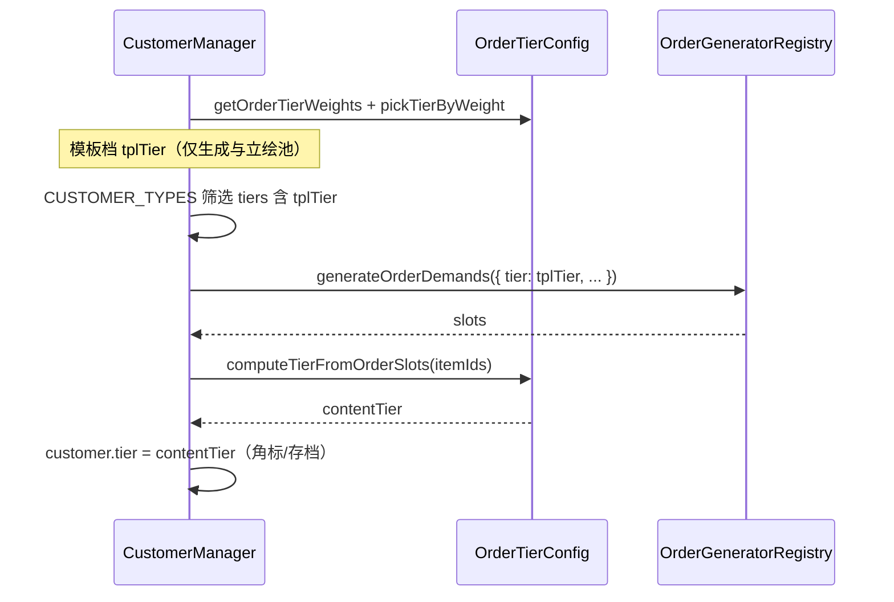

# 订单等级（A/B/C/S）如何判定

## 核心结论（当前实现）

- **UI 角标与存档中的 `tier`**：由 **[`computeTierFromOrderSlots`](../src/config/OrderTierConfig.ts)** 根据**需求槽内物品**在全游产品线中的相对难度统一计算，**全玩家同一套标尺**。
- **相同 multiset 必同档**：对 `itemId` **排序**后再算分，左右槽顺序不影响角标。
- **生成仍用「模板档」**：[`pickTierByWeight` + `generateOrderDemands`](src/managers/CustomerManager.ts) 里的随机档只决定**抽什么需求**、以及 [`CustomerConfig`](src/config/CustomerConfig.ts) **立绘池**（`tiers.includes(模板档)`）；角标**不再**等于模板档。

## 内容档位公式（摘要）

对每个槽：`norm = item.level / getMaxLevelForLine(category, line)`（封顶 1）。

- `score = 0.45 * max(norm) + 0.55 * avg(norm) + slotBonus`（2 槽 +0.03，3 槽 +0.06）
- `score < 0.30` → C；`< 0.48` → B；`< 0.68` → A；否则 S。

细节与调参见 [`OrderTierConfig.ts`](../src/config/OrderTierConfig.ts) 内 JSDoc。

## 代码流程（每位新客人）

## 与客人类型的关系

立绘仍按 **模板档** 从 `CUSTOMER_TYPES.tiers` 筛选，因此可能出现「角标 B、脸模来自原 A 池模板」等组合；角标只反映**物品客观难度**，不与立绘一一对应。

## 读档

[`normalizeCustomerPersistState` / `init`](src/managers/CustomerManager.ts) 会根据槽位 **重算** `tier`，旧存档角标会与当前公式对齐。
